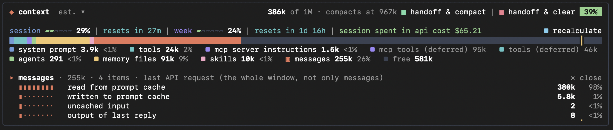
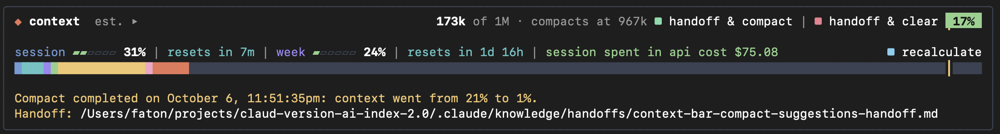
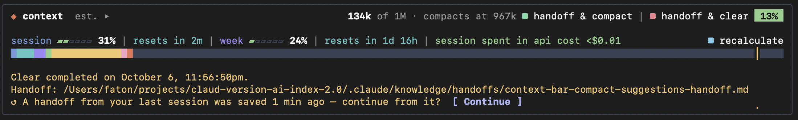
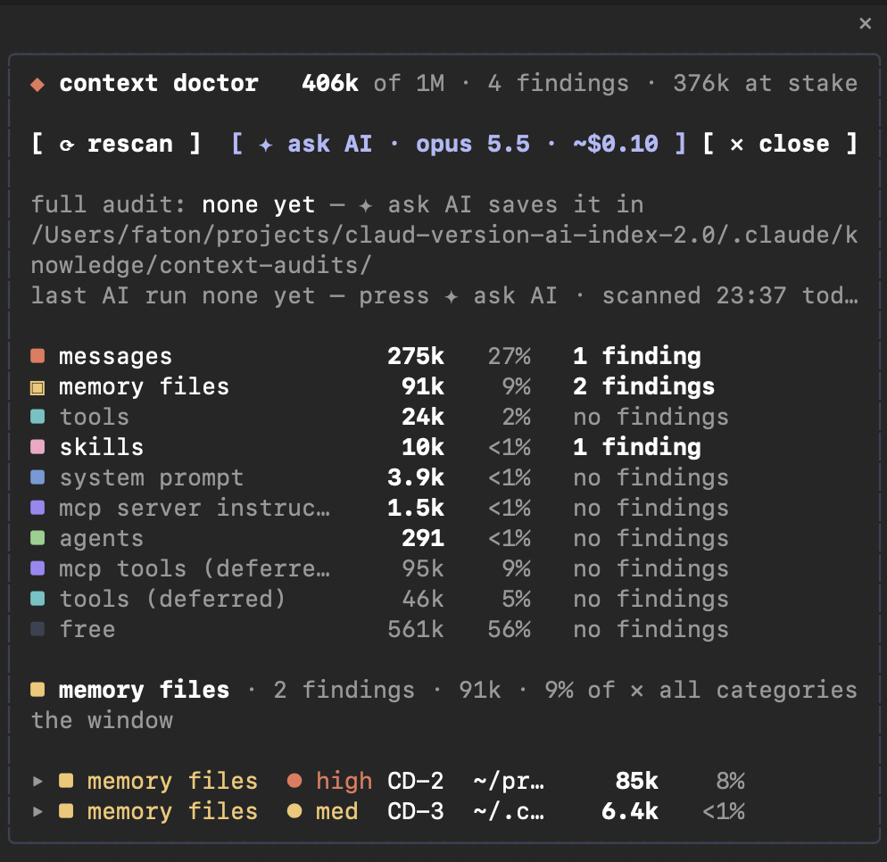

# claude-context-bar

Claude Code plugin for context window transparency and management. `context-bar` displays what occupies the context
window, prompts compaction at task boundaries, saves verified handoffs before `/compact` or `/clear`, and audits the
tokens loaded on every request.


Version `0.18.0` · [changelog](CHANGELOG.md)

## Contents

- [Context window constraints](#context-window-constraints)
- [Requirements](#requirements)
- [Surfaces](#surfaces)
- [Install](#install)
- [Update and uninstall](#update-and-uninstall)
- [Usage](#usage)
- [Settings](#settings)
- [Privacy and cost](#privacy-and-cost)
- [Contributing](#contributing)
- [License](#license)

## Context window constraints

| Constraint | Effect | `context-bar` response |
|---|---|---|
| Context composition is visible only on demand, through `/context`. | Large tool results, file reads and memory files go unnoticed until auto-compaction triggers. | The bar shows usage and composition by category and refreshes within 1.5 s of every prompt and tool call. |
| Auto-compaction triggers when the context window reaches its limit, including mid-task. | The compaction summary can omit approvals, plan progress, open errors and running subagents. | Prompts compaction at task boundaries. Adds a keep list to every compaction. `handoff & compact` saves a verified handoff first. |
| `/clear` flushes the active context window. | New sessions require explicit context re-initialization: goals, status, next steps. | `handoff & clear` saves a verified handoff. `Continue` restores it in the next session. |
| `CLAUDE.md`, active MCP server tool definitions and the skills listing load on every request. | Static token overhead on every request cycle accelerates auto-compaction. | `/context-doctor` flags oversized items and plans each fix with the tokens it frees. |

## Requirements

Claude Code `2.1.275` or later. Built and tested on `2.1.292`. Any theme: category colours keep a 3:1 contrast on
light and dark backgrounds, and every other colour is a Claude Code theme key that follows the active theme.

## Surfaces

| Surface | Bar |
|---|---|
| Terminal | Renders above the prompt. The colour strip is clickable. |
| Claude Code Desktop, `Code` tab | Renders above the prompt. The colour strip is clickable. |
| VS Code extension | `/context-bar` opens the bar as a pane. |
| Claude mobile app | `/context-bar` opens the bar as a pane. |
| `claude.ai/code` in a browser | See below. |

Claude Code `2.1.292` defines four plugin render surfaces: `terminal`, `desktop`, `vscode` and `mobile`. A browser
session at `claude.ai/code` is one of two kinds:

- **Remote Control session**: the session runs on the local machine and the plugin runs there. Its hooks apply to
  prompts and compactions started from the browser. Run `/context-bar status` and read `Drawn on:` to list the
  surfaces that draw the bar.
- **Cloud session**: the session runs on Anthropic's infrastructure. It loads no locally installed plugins. Where
  `/cloud-plugins` is available, run it on the machine that starts the cloud session to send its enabled plugins.

## Install

Run in a Claude Code session:

```
/plugin install context-bar --marketplace fatonsopa/claude-context-bar
```

Confirm the marketplace and select a scope. The bar renders above the prompt.

Two-step alternative:

```
/plugin marketplace add fatonsopa/claude-context-bar
/plugin install context-bar@claude-context-bar
```

Shell alternative:

```bash
claude plugin marketplace add fatonsopa/claude-context-bar
claude plugin install context-bar@claude-context-bar
```

Load a local checkout for one session:

```bash
claude --plugin-dir <path>/claude-context-bar
```

## Update and uninstall

The bar updates itself:

1. At most once an hour, across sessions, it reads `version` from `.claude-plugin/plugin.json` on the `main` branch.
2. When that version is newer than the running one, it runs `claude plugin update context-bar@claude-context-bar`
   in the background.
3. The bar shows `✓ context-bar <version> installed · Run /reload-plugins or start a new session to apply`. Select
   `✕` to hide the line.

Set `auto_update` to `false` to skip step 2: the bar shows `context-bar <version> is out` with the update command and
a `[copy]` button. `/context-bar update` checks and installs immediately, whatever `auto_update` says. A checkout
loaded with `--plugin-dir` or `CLAUDE_CODE_PLUGIN_DIRS` is never updated.

Manual update and uninstall:

```bash
claude plugin update context-bar@claude-context-bar
claude plugin uninstall context-bar@claude-context-bar
```

Versions before `0.18.0` have no self-update: run the update command once.

## Usage

### Context bar

The bar renders above the prompt and refreshes within 1.5 s of every prompt and tool call.



- **Usage**: tokens used, the auto-compaction threshold and a percentage badge. The badge turns yellow at 60% of the
  distance to auto-compaction and red at 85%. `est.` marks a local estimate. Select `recalculate` for an exact count
  at no cost.
- **Composition**: the colour strip divides the window by category. Select `▸` or the strip to list the categories
  with their token counts. Select a category to list its items, largest first. Select an item marked `▸` to list its
  sections or tools. Select `✕ close` to collapse the list.
- **Rate limits and cost**: each rate-limit window (session, week, per-model week) shows a meter, a percentage and the
  time to reset. The session cost is shown at API prices.
- **Handoff buttons**: `handoff & compact` and `handoff & clear`. See [Handoff](#handoff). At a task boundary, the bar
  marks the recommended button with `▣`.
- **Audit progress**: while the `/context-doctor` AI audit runs, a status line shows its progress. Select the line to
  view the summary, the top 5 actions and the audit file. `draft` inserts an action into the prompt box. `[copy path]`
  copies the file path. `[open doctor]` opens the doctor pane. `✕` removes the line.

### Compaction

The bar prompts compaction after a commit, a push or a skill run of at least `long_skill_run_minutes` (default `5`).
The prompt appears only when all conditions hold:

- The conversation holds at least `suggest_compact_at_tokens` (default `80000`).
- No subagent or background command is running, no git merge or rebase is in progress, and no tests are failing.
- No compaction ran in the last 10 minutes.

Every compaction (`/compact`, auto-compaction or another plugin's) receives a keep list. The summary must retain:

1. Modes and settings switched on or off, and the current state of each.
2. Approvals, in the user's exact words, with their scope and any pending approval.
3. The current task or plan, with completed and next steps.
4. Running subagents and background tasks, with their IDs.
5. Open errors and failing tests, with the exact message and `file:line`.
6. Changed files, backup paths and pending commitments.

After compaction, the bar appends a note with the folder, branch, `HEAD` and changed files, read from git. The summary
is saved to `~/.claude/handoffs/<project>/<time>-compact.md`.

`/compact` shows a warning while a subagent, background command, merge or rebase is active, or while tests fail.

When one tool result reaches `long_output_tokens` (default `15000`), the bar recommends a subagent for long logs and
files.

### Handoff

- `handoff & compact` saves a handoff, then compacts the conversation. Use it to continue the same task with a smaller
  context.
- `handoff & clear` saves a handoff, then runs `/clear`. Use it before switching to unrelated work.
- `/context-bar handoff` runs the same flow as `handoff & clear`.

Both buttons run this sequence:

1. Claude writes the handoff to a hidden draft file. The chat does not display it.
2. The bar validates the required sections: `Goal`, `Where things stand`, `Decisions and approvals`, `Next steps`,
   `How to verify`, `How to resume`, and `Open tasks` when tasks exist. If a section is missing, the bar saves and
   flags the file and does not compact or clear.
3. The bar saves the handoff to `handoff_folder` (default `.claude/knowledge/handoffs`, relative to the repository
   root) with the open tasks attached. Outside a git repository, it saves to `~/.claude/handoffs/<project>/`.
4. The bar compacts the conversation or runs `/clear`.





To resume:

- Select the handoff path under the result to open the file.
- After `/clear`, or in a new session within `offer_handoff_hours` (default `6`), select `Continue`. It inserts a
  request into the prompt box to recreate the open tasks and follow the handoff's `How to resume` section.
- Send any other message to dismiss `Continue`.

### Context doctor

`/context-doctor` audits the tokens loaded on every request, grouped by the bar's categories. Run it when context
usage is already high at session start, after adding MCP servers, skills, agents or memory files, or when
auto-compaction triggers earlier than expected.

```
/context-doctor [--model=opus|sonnet|haiku|fable|<id>] [--effort=low|medium|high|xhigh|max] [ask]
```

`--model` and `--effort` set the model and effort of the AI audit. `ask` starts the AI audit immediately.

Local checks, at no cost:

| Category | Flags | Severity |
|---|---|---|
| memory files | A file of 3k+ tokens | `med`, `high` from 10k |
| mcp tools | A server of 2k+ tokens never called this session | `med`, `high` from 10k |
| skills | Skills that don't fit the listing · a listing of 3k+ tokens | `med` · `low` |
| agents | Agent descriptions of 2k+ tokens | `low` |
| tools · system prompt | 25k+ · 10k+ tokens | `info` |
| messages | Context at 40% / 60% of the distance to auto-compaction | `med` / `high` |

Pane controls:

- **Findings**: select a category to filter its findings. Select a finding to view the measurement and its impact.
  `⟳ rescan` measures again. `✕ close` or `Escape` closes the pane.
- **AI audit** (paid, optional): select `✦ ask AI`. The button shows the cost before sending. The audit returns a
  summary and a step-by-step plan per finding, with the tokens each step frees. The audit is saved as Markdown with
  `CD-` references in the project's `.claude/` folder. `[open]` opens the file, `[copy path]` copies its path and
  `▸ full audit` renders it in the pane.
- **Deep-dive** (paid, optional): generates a finer plan from the full text of one memory file.
- **Draft**: `draft` inserts a step's instruction into the prompt box. Nothing runs until you press `Enter`. Claude
  asks before editing files.
- **Commands to copy**: `/mcp`, `ENABLE_TOOL_SEARCH=true`, `/skill-doctor`, `/agents`, `/compact`, `/clear` and file
  paths.
- **Background progress**: the bar shows the audit's progress. Close the pane while the audit runs.



### Commands

| Command | Action |
|---|---|
| `/context-bar` | Show the bar. |
| `/context-bar off` | Hide the bar. |
| `/context-bar pane` | Open the bar as a pane. |
| `/context-bar recalculate` | Replace the estimate with an exact count. |
| `/context-bar handoff` | Run `handoff & clear`. |
| `/context-bar update` | Check for a new version now and install it. See [Update and uninstall](#update-and-uninstall). |
| `/context-bar status` | Print the version, running work, current suggestion, last handoff, open tasks, settings, the last update check and the surfaces drawing the bar. |
| `/context-doctor` | Open the context doctor. |
| `/context-doctor help` | Print usage. |

## Settings

Open `/plugin` → `Installed` → `context-bar` → `Configure options`.

| Option | Key | Default | Effect |
|---|---|---|---|
| Suggest compacting at (tokens) | `suggest_compact_at_tokens` | `80000` | Minimum conversation size for compaction prompts. |
| Long output tip at (tokens) | `long_output_tokens` | `15000` | Tool result size that triggers the subagent recommendation. |
| Long skill run (minutes) | `long_skill_run_minutes` | `5` | Skill run duration that counts as finished work. |
| Offer a handoff for (hours) | `offer_handoff_hours` | `6` | Maximum handoff age for `Continue`. |
| Handoff folder | `handoff_folder` | `.claude/knowledge/handoffs` | Handoff location, relative to the repository root. |
| Commit handoffs | `commit_handoffs` | `true` | Commit each saved handoff file. The bar never pushes. |
| Update automatically | `auto_update` | `true` | Install new versions in the background. `false`: only announce them. |

## Privacy and cost

- The bar, the compaction prompts and the doctor's checks run locally.
- `recalculate` runs at no cost.
- A handoff costs one Claude turn.
- `✦ ask AI` and deep-dive send the measurements, or one file, to the selected model. Each button shows its cost
  before sending.
- The bar commits each handoff to the repository as one file and never pushes. Set `commit_handoffs` to `false` to
  disable commits.
- The update check sends at most one request per hour to `raw.githubusercontent.com`. An update runs
  `claude plugin update`, which fetches the marketplace repository from GitHub.

## Contributing

Run before opening an issue or pull request:

```bash
claude plugin validate .
claude plugin test
```

Follow [`docs/style-guide.md`](docs/style-guide.md) for documentation changes.

## License

No license. All rights reserved by Faton Sopa.
