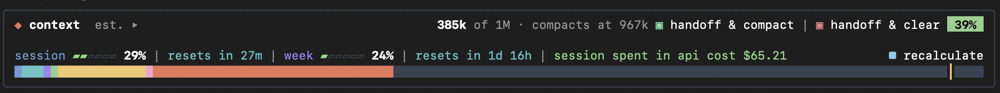

# context-bar

**See what fills Claude Code's context window, and keep long work going across compactions and new sessions.**

A Claude Code mod with three parts:

- **The context bar**, above the prompt: how full the context is, what fills it by category, your rate limits, and
  this session's cost.
- **Compact and handoff**: two buttons that write a proper handoff and then compact or clear. At natural stopping
  points the bar suggests which one to press. Open tasks carry over to the next session.
- **The context doctor** (`/context-doctor`): an audit of what takes room in the context, with AI recommendations you
  can act on.

It works in any project. Every signal it reads is one that Claude Code or git gives everywhere; nothing is tied to one
repository.



Version 0.17.0 · built and tested on Claude Code 2.1.292 · [changelog](../CHANGELOG.md)

## Contents

- [Install](#install)
- [The context bar](#the-context-bar)
- [Compact and handoff](#compact-and-handoff)
  - [handoff & compact](#handoff--compact)
  - [handoff & clear](#handoff--clear)
- [The context doctor](#the-context-doctor)
- [Commands](#commands)
- [Settings](#settings)
- [Privacy and cost](#privacy-and-cost)
- [Files it writes](#files-it-writes)
- [Limitations](#limitations)
- [Troubleshooting](#troubleshooting)
- [Develop](#develop)

## Install

```
/plugin install context-bar --marketplace fatonsopa/ai-dev-architecture
```

Answer `y` to add the marketplace, then pick a scope. The bar appears above the prompt.

To run it from a local checkout instead, add the folder to `CLAUDE_CODE_PLUGIN_DIRS` in `~/.claude/settings.json`
(under `env`), or start Claude Code with `claude --plugin-dir <path>/context-bar`.

## The context bar


- **Header.** Tokens used of the window, where auto-compact starts (or "auto-compact off"), and how full it is as a
  percentage. `est.` means a local estimate with no API call; `exact` means counted with Claude Code's free
  token-count API.
- **Limits line.** Each rate-limit window your account reports (session, week, model-specific weeks) as a small
  meter, its percentage and when it resets, then this session's cost at API list prices. On a subscription, the
  cost is a measure of how heavy the session is, not a bill. **recalculate**, at the right, counts the context
  exactly.
- **Colour strip.** One cell per share of the window, in each category's colour, with a mark where auto-compact
  starts.
- **Categories.** Press the bar or `▸` to list the categories, each with its tokens and share of the window: system
  prompt, tools, mcp server instructions, mcp tools, memory files, skills, agents, messages and free space (deferred
  tools are listed apart, since they load only when used). Press a category to see what is in it, largest first. An
  item marked `▸` opens a third level: a file's sections, a server's tools, a skill's description.

`/context-bar off` hides the bar and `/context-bar` shows it again. In VS Code and on mobile it opens as a pane.

## Compact and handoff

### The two buttons

| Button | What it does |
|---|---|
| **handoff & compact** | Claude writes a handoff for the work. The bar saves it (and commits it), then compacts the conversation. |
| **handoff & clear** | The same handoff, then the bar runs `/clear`. |

Both always sit in the header. At a good moment, the right button's `■` becomes `▣` and a line under the strip says
what just finished:

| When | The line says | Suggested |
|---|---|---|
| A `git commit` succeeded | `✓ Changes committed` | handoff & compact |
| A `git push` sent something | `✓ Pushed to GitHub` (GitLab, Bitbucket, … or the host) | both |
| A turn that used a skill ran longer than *Long skill run* | `✓ /<skill> finished` | both |
| `/clear` or a new session, with a handoff newer than *Offer a handoff for* | `↺ A handoff from your last session was saved … — continue from it?` | **Continue** |

The suggestion stays until you press a button, a compaction shrinks the context, or a newer moment replaces it.
There is no "later" button. Nothing is suggested while a turn runs, while subagents or background commands are still
running, during a git merge or rebase, or while the last test run failed. A moment that comes during such work is
offered as soon as the work ends. If you type `/compact` at a bad moment, the bar warns you and still compacts.

### handoff & compact

Use it when you keep working on the same thing and want a lighter context: after a commit, a push, or a long skill
run. The conversation goes on in the same session, with a summary in place of the history and a handoff on disk in
case you need more detail later.

**Before you press it.** Wait for Claude to finish its current step; pressed mid-turn, the bar says
`Wait until Claude finishes the current step, then hand off.` and does nothing.

**What happens, and what the bar shows at each step:**

1. **Claude writes the handoff.** One collapsed Write in the transcript and a one-line reply, "Handoff written." The
   handoff goes to a hidden draft file and is never printed, so it isn't paid for twice.

   ```
   Writing the handoff…
   ```
2. **The bar checks it.** Every required section must be there, and every open task must be named. If anything is
   missing, the file is saved but flagged and **nothing is compacted**:

   ```
   Handoff failed on October 6, 10:41:47pm: /…/handoffs/<name>-handoff.md is missing How to verify. Nothing was compacted.
   ```
3. **The bar saves and commits it** as `<name>-handoff.md`, named after the plan or the work (for example
   `context-bar-compact-suggestions-handoff.md`), and removes the draft. It commits only that file, by path, so
   nothing else you have staged goes with it. If git refuses (a hook, a merge in progress), the line says
   `(not committed: <reason>)` and the compaction still runs.
4. **The bar compacts the conversation.** The summary is focused on what just finished and told where the handoff
   is; it keeps the [keep list](#every-compaction-keeps-what-matters) and the git state.

   ```
   Handoff completed on October 6, 10:41:47pm: /…/.claude/knowledge/handoffs/<name>-handoff.md
   Compacting… this can take a minute.
   ```
5. **The result**, until your next message:

   ```
   Compact completed on October 6, 10:42:30pm: context went from 89% to 2%.
   Handoff: /…/.claude/knowledge/handoffs/<name>-handoff.md
   ```

**After it.** The handoff path is a link that opens the file. Your task list stays as it was, since the session goes
on. A copy of the summary is saved to `~/.claude/handoffs/<project>/<time>-compact.md`. The bar makes no new
suggestion for the next 10 minutes.

### handoff & clear

Use it when the next task has nothing to do with this one. Steps 1 to 3 are the same, then the bar runs `/clear`
instead of compacting:

```
Clear completed on October 6, 10:42:05pm.
Handoff: /…/.claude/knowledge/handoffs/<name>-handoff.md
```

The new conversation starts empty. The bar offers the handoff there
(`↺ A handoff from your last session was saved … — continue from it?`), and **Continue** puts a request in the prompt
box to read it, recreate the open tasks, run its checks and say where things stand. `/context-bar handoff` starts the
same thing from the prompt.

### The handoff

Sections follow Anthropic's guidance for carrying work across sessions: self-contained, evidence instead of claims,
failed approaches recorded, and a check to run before new work.

| Section | Required |
|---|---|
| Goal | yes |
| Where things stand (each item with its evidence) | yes |
| Decisions and approvals (quoted) | yes |
| Next steps (numbered, with exact commands) | yes |
| Open tasks | when the task list has open tasks |
| How to verify | yes |
| Open problems · Tried and did not work · Files · Running · Out of scope · Open questions | when there is something to say |
| How to resume | yes |

Under Claude's text, the bar adds the git state it read itself (folder, branch, last commit, uncommitted files).

### Open tasks carry over

The bar keeps an exact copy of the session's task list: every `TaskCreate`, `TaskUpdate` and `TodoWrite`. A
subagent's own tasks are left out.

- The handoff must have an **Open tasks** section with one entry per open task: its exact subject, its status, and the
  context needed to pick it up cold (where it stopped, the files, the next command). A handoff that leaves one out
  fails the check.
- The bar appends **Task list to recreate on resume**: the open tasks exactly as the list held them (subject,
  description, spinner text, status, and what each is blocked by), as JSON.
- **Continue** asks the next session to recreate those tasks first, then follow "How to resume".

`/context-bar status` shows how many open tasks the next handoff will carry.

### Every compaction keeps what matters

Every compaction (yours, an automatic one, or the button's) gets a keep list: modes switched on or off (such as
`#autonomous`), approvals in your own words, the plan and its steps, running subagents, open errors, and files and
backups. After the summary, the bar puts back a note of where things stood in git. The summary is also saved to
`~/.claude/handoffs/<project>/<time>-compact.md` and named on the result line. Project-specific rules for summaries
belong in the project's `CLAUDE.md` ("Compact Instructions"), which Claude Code applies itself.

## The context doctor

`/context-doctor` opens a pane that audits the context window by the same categories as the bar.


1. **Findings, without AI.** It measures what each category holds and flags what is worth a look: a memory file that
   loads many tokens on every request, MCP servers whose tools load but were never called, skills that don't fit the
   listing (so Claude can't see them), unused custom agents, and the size of the built-in tools and system prompt.
   Findings are grouped by category, largest categories first. Press a category chip to show only its findings.
2. **✦ ask AI** (optional, paid). One model call over the measurements. It returns a summary and, for each finding, a
   plan: numbered steps, each saying exactly where, what to change, how to check it worked, and the tokens it should
   free. The button shows the model and the estimated cost before you press it.
3. **deep-dive** (optional, paid). One more call over a single file's full text, for a finer plan.
4. **draft** puts a step's ready-made instruction in your prompt box. Nothing runs until you press Enter, and the
   instruction tells Claude to ask before editing.

Each AI audit is saved as Markdown, with references (`CD-3`, `CD-3.2`) you can quote, in the project's
`.claude/knowledge/context-audits/` (or `.claude/context-audits/` when there is no `.claude/knowledge/`). While the AI
works, the bar shows a spinner. When it is done the bar says the audit is ready and can show its summary, the top
five actions and the file.

```
/context-doctor                          # open, scan, and wait for "ask AI"
/context-doctor ask                      # open and ask the AI straight away
/context-doctor --model=sonnet --effort=high ask
```

`--model` takes `opus` (default: claude-opus-5-5), `sonnet`, `haiku`, `fable`, or any model id. `--effort` takes `low`,
`medium`, `high`, `xhigh` or `max`. Each run uses its own flags; nothing carries over from the last run.

## Commands

| Command | What it does |
|---|---|
| `/context-bar` | Show the bar (or open it as a pane in VS Code and on mobile) |
| `/context-bar off` | Hide the bar |
| `/context-bar pane` | Open the bar as a pane |
| `/context-bar recalculate` | Count the context exactly with the free token-count API |
| `/context-bar handoff` | Start **handoff & clear** now |
| `/context-bar status` | What the bar sees: version, what is running, the suggestion, the last handoff and how it ended, open tasks, settings |
| `/context-doctor [--model=…] [--effort=…] [ask]` | Open the context doctor |

## Settings

Set in `/config`, under the plugin's options.

| Setting | Key | Default |
|---|---|---|
| Suggest compacting at (tokens of conversation) | `suggest_compact_at_tokens` | 80,000 |
| Long output tip at (tokens in one tool result) | `long_output_tokens` | 15,000 |
| Long skill run (minutes) | `long_skill_run_minutes` | 5 |
| Offer a handoff for (hours) | `offer_handoff_hours` | 6 |
| Handoff folder (relative to the repository) | `handoff_folder` | `.claude/knowledge/handoffs` |
| Commit handoffs | `commit_handoffs` | on |

## Privacy and cost

- **The bar and the suggestions** run on your machine. They read Claude Code's own context breakdown, tool results
  and git. Nothing leaves your machine. **recalculate** uses Claude Code's token-count API, which is free.
- **A handoff** is one ordinary Claude turn, billed like any message. It is saved and committed locally; the bar never
  pushes.
- **The context doctor's findings** are computed locally. **✦ ask AI** sends one request to the chosen model with the
  measurements: category sizes, memory file paths with their section headings, sizes and opening lines, MCP server
  and tool names, skill and agent names, and which tools were used. A **deep-dive** sends that one file's full text.
  Each call's cost is estimated on its button before you press it, and the actual cost is shown afterwards at API
  list prices.

## Files it writes

| What | Where |
|---|---|
| Handoffs (in a git repository) | `<repo>/<handoff folder>/<name>-handoff.md`, committed by path |
| Handoffs (outside a repository) | `~/.claude/handoffs/<project>/` |
| A compaction's summary | `~/.claude/handoffs/<project>/<time>-compact.md` |
| Context doctor audits | `<repo>/.claude/knowledge/context-audits/` or `<repo>/.claude/context-audits/` |

The latest handoff per project and the last handoff run's outcome are kept in Claude Code's plugin store, for
**Continue** and `/context-bar status`.

## Limitations

- The task-list copy starts when the bar loads. Tasks made before that in the same session are not carried.
- Colours are tuned for dark terminals: every button and the yellow line keep a 4.5 : 1 contrast on a dark background.
  Light themes are not tuned yet.
- In a terminal without hyperlink support, a handoff path is printed followed by its `file://` address.

## Troubleshooting

| Problem | What to do |
|---|---|
| No bar above the prompt | Run `/context-bar`. If it was hidden, this shows it. |
| Not sure which version is running | `/context-bar status` prints it on its first line. |
| `Handoff failed … is missing <section>` | Claude left a section or an open task out. The file is saved and flagged; nothing was compacted or cleared. Press the button again. |
| `not committed: <reason>` | The handoff is saved but git refused the commit (a hook, a merge in progress). Commit it yourself if you want it in git. |
| A suggestion seems missing | Something may still be running. `/context-bar status` shows what is busy and what is waiting to be offered. |

## Develop

```bash
claude plugin validate context-bar      # manifest, hooks module, state contract
claude plugin test context-bar          # the test suite
tsc -p context-bar --noUnusedLocals     # after Claude Code has loaded the mod once (it writes the types)
```

`hooks/version.ts` must match `version` in `.claude-plugin/plugin.json`; `/context-bar status` prints it.

| File | What it holds |
|---|---|
| `hooks/register.tsx` | The hooks, and the engine access they use |
| `hooks/snapshot.ts`, `hooks/categories.ts` | Reading the context breakdown into rows, colours and lists |
| `hooks/barView.tsx`, `hooks/limitsView.tsx` | The bar and its limits line |
| `hooks/compact.ts` | Compaction and handoff rules and wording (pure functions) |
| `hooks/compactFlow.ts`, `hooks/compactView.tsx` | The compact and handoff flow, and its line in the bar |
| `hooks/doctor.ts`, `hooks/doctorView.tsx`, `hooks/auditFile.ts` | The context doctor |
| `hooks/noticeView.tsx` | The doctor's progress and result in the bar |
| `types/index.d.ts` | The mod's state contract |
| `tests/` | The test suite (`claude plugin test`) |
